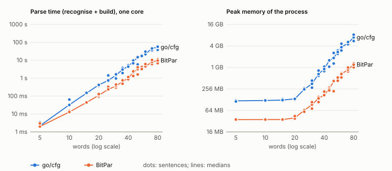

# The fast context-free parser, and what a hyperedge is

Package `go/cfg` parses context-free grammars: grammars whose categories
are plain symbols, with no features to unify. It builds the same packed
forest as the feature parser in `go/chart` would, but faster: 0.11 s
against 49 s for a 15-token sentence under a treebank grammar read off
MASC. This note explains how, starting with the idea everything else rests
on: the forest as a hypergraph.

None of the method is new. It is, in all essentials, Helmut Schmid's BitPar
(2004): bit-vector CKY recognition, then a top-down pass that builds a
packed forest of only the items on a complete parse. §8 gives the sources
and what differs.

## 1. Items and hyperedges

### Two words for "edge"

Chart parsing and hypergraphs both use the word "edge", for different
things, and that is the source of most confusion:

| | chart parsing (Kay, and `go/chart`) | a parse forest as a hypergraph |
|---|---|---|
| a constituent, e.g. an NP over words 2 to 4 | an **edge** (a complete edge; a partial edge is a dotted rule) | a **node**, or **item** |
| one way of building it: a rule and the constituents it combines | a **predecessor pair** of the edge | a **hyperedge** |

So an *item* is a thing that was found, a symbol over a span, and a
*hyperedge* is a reason for believing in it: one application of one rule
to particular children. `go/cfg` uses the hypergraph words.

### A worked example

Take the textbook grammar

    S -> NP VP     VP -> V NP     VP -> VP PP
    NP -> NP PP    NP -> Det N    PP -> P NP

with the words "I" (NP), "saw" (V or N), "the" (Det), "man" and
"telescope" (N) and "with" (P). The sentence

    0 I 1 saw 2 the 3 man 4 with 5 the 6 telescope 7

has two trees: I used the telescope to see the man, or the man had it.
Here is the whole forest the parser builds, 14 items with their hyperedges
(each in brackets), children before parents:

    NP(0,1)   [word "I"]
    V(1,2)    [word "saw"]
    Det(2,3)  [word "the"]
    N(3,4)    [word "man"]
    P(4,5)    [word "with"]
    Det(5,6)  [word "the"]
    N(6,7)    [word "telescope"]
    NP(2,4)   [Det(2,3) N(3,4)]
    NP(5,7)   [Det(5,6) N(6,7)]
    VP(1,4)   [V(1,2) NP(2,4)]
    PP(4,7)   [P(4,5) NP(5,7)]
    NP(2,7)   [NP(2,4) PP(4,7)]
    VP(1,7)   [VP(1,4) PP(4,7)]   [V(1,2) NP(2,7)]
    S(0,7)    [NP(0,1) VP(1,7)]

Every item but one has a single hyperedge. VP(1,7) has two: it can be
built by VP → VP PP from VP(1,4) and PP(4,7), or by VP → V NP from V(1,2)
and NP(2,7). That one item with two hyperedges *is* the ambiguity. The two
trees share everything else: there is one PP(4,7) and one NP(2,4), used by
both.

### Why "hyper"

An edge in an ordinary directed graph goes from one node to one node. A
hyperedge goes from a *tuple* of nodes, the children, to one node, the
parent:

                      VP(1,7)
                    /        \
         hyperedge 1          hyperedge 2
          /       \            /       \
      VP(1,4)   PP(4,7)     V(1,2)   NP(2,7)

Hyperedge 1 joins VP(1,4) and PP(4,7) into VP(1,7); it is not two edges,
because neither child alone builds anything. A lexical entry is a hyperedge
with no children at all: `[word "the"]`. A forest is a directed acyclic
hypergraph, and a tree is what you get by choosing, from the root down,
one hyperedge at each item you reach.

Hyperedges are not something extra that a parser can do without. Any
packed forest needs them, context-free or not, the moment an item can be
built in more than one way; without them it could store the items but not
the trees. `go/chart` has them too, as each edge's list of predecessor
pairs. Its hypergraph also has nodes for partial, dotted edges, so a
three-daughter rule becomes a chain of pairs.

### Counting trees

The number of trees under an item is a sum over its hyperedges of a
product over their children:

    trees(item) = Σ over hyperedges h of item  Π over children c of h  trees(c)

with the empty product, 1, for a lexical hyperedge. Here every item has
one tree except VP(1,7), which has 1 × 1 + 1 × 1 = 2, so S(0,7) has
1 × 2 = 2. Visiting items children first makes this one pass over the
forest, however many trees it holds. The 15-token sentence above has
3.6 × 10²³ trees in 36,349 items and 427,236 hyperedges.

Writing the lexical entries as explicit hyperedges caught a bug. `go/chart`
and the Kotlin chart took "no predecessors" to mean "a word", so an item
that was a word *and* built by a rule (a B over "x", when "x" is a B and
B → A with "x" an A) lost its word reading. The fast parser counted it,
the two parsers disagreed on a random grammar, and both charts are now
fixed.

## 2. Binarization by frequent pairs

The parser only ever joins two items, so a rule of more than two daughters
is broken into steps, each joining two symbols. `go/cfg` does this as
BitPar does (Schmid 2004, crediting Andreas Eisele): count how often each
pair of neighbouring daughters occurs over all the rules; then let each
rule in turn replace its most frequent pair with an *auxiliary symbol*
standing for that pair, adjust the counts, and repeat until every rule has
two symbols left. If those two occur together in other rules too, they
become an auxiliary symbol as well, and the rule a unary step over it. The
rules

    NP -> Det Adj N       NP -> Det Adj N PP      NP -> Det N
    Nom -> Adj N          PP -> P NP

become

    {Adj N}          -> Adj N
    {Det {Adj N}}    -> Det {Adj N}
    NP               -> {Det {Adj N}}       (completes NP -> Det Adj N)
    NP               -> {Det {Adj N}} PP    (completes NP -> Det Adj N PP)
    NP               -> Det N
    Nom              -> {Adj N}             (completes Nom -> Adj N)
    PP               -> P NP

`Adj N` occurs in three rules, so it is paired first, and the two NP rules
and Nom all share `{Adj N}`. An auxiliary symbol can stand for daughters
anywhere in a rule, not only at the start, and for daughters of rules with
different parents. Each rule still has exactly one binary tree, and each
auxiliary symbol exactly one step, so derivations are in one-to-one
correspondence with the grammar's own and tree counts are unchanged. For
"the old man with the dog", with NP as the start symbol:

    {Adj N}(1,3)         [Adj(1,2) N(2,3)]
    {Det {Adj N}}(0,3)   [Det(0,1) {Adj N}(1,3)]
    NP(4,6)              [Det(4,5) N(5,6)]
    PP(3,6)              [P(3,4) NP(4,6)]
    NP(0,6)              [{Det {Adj N}}(0,3) PP(3,6)]

Trees are reported in the grammar's own rules: an auxiliary item's children
are spliced into its parent, giving `(NP (Det the) (Adj old) (N man) (PP ...))`.

Sharing matters for treebank grammars, which are flat and repetitive. The
MASC grammar has 21,273 rules, 18,732 of them with more than two
daughters. Binarized by pairs it has 24,042 binary steps, 9,513 of them
building auxiliary symbols, and 6,744 unary steps. The first version of
`go/cfg` shared only prefixes (`|Det Adj`, `|Det Adj N`), which gave 45,029
binary steps and, on MASC sentences, 1.8 times as many hyperedges (§6).

## 3. Two passes

### Bottom-up: what is derivable where

The first pass is CKY. For every span, shortest first, it computes the set
of symbols derivable over it: the words' lexical symbols; every parent of a
binary step whose left child is derivable over (i, k) and right child over
(k, j), for each split k; then everything reachable from those by unary
steps. Each set is a bitset (one bit per symbol) and also a list of the
symbols found, so "is C derivable over (k, j)?" is one bit test and "what
is derivable over (i, k)?" is a list. For each left symbol the pass either
walks that symbol's steps and tests their right children, or walks the
right cell's symbols and looks them up, whichever list is shorter.

This pass stores no hyperedges and no items, only bits. It finds every
symbol over every span that the words support, which includes a great deal
that no parse of the whole sentence uses. In the example, "saw" is also a
noun, so N(1,2) is derivable, and "I saw the man" is an S, so S(0,4) is
derivable. Neither is on a parse of the whole sentence: 16 derivable
items, 14 in the forest.

### Top-down: only what a parse uses

The second pass starts from the start symbol over the whole input and
works down. For an item it has reached, it looks at every step that could
build it: a lexical entry, a unary step whose child is derivable over the
same span, or a binary step whose children are derivable over (i, k) and
(k, j) for some k. Each one found becomes a hyperedge, and each child not
yet reached becomes an item and is visited in turn.

An item is reached exactly when it lies on some derivation of the whole
input: it must be derivable (the first pass) and connected to the root (the
second). So dead items are never stored at all. On treebank grammars they
are most of what a bottom-up parser builds:

| tokens | derivable (pass 1) | items in the forest | hyperedges |
|---|---|---|---|
| 15 | 109,330 | 36,349 | 427,236 |
| 30 | 927,533 | 416,486 | 6,599,726 |
| 60 | 3,632,467 | 1,497,846 | 56,957,292 |

(The feature parser, which has only the bottom-up pass, built 109,330
complete edges and 339,854 partial ones for the 15-token sentence, and kept
them all.)

### Unary steps

Unary steps join one child over the same span, so within a span their
order matters. The grammar is checked at load time for unary cycles (A → B
→ A), which would give infinitely many trees, and refused if it has one;
each symbol gets a rank above everything it can be built from by unary
steps, and items are visited by width, then rank. Treebank grammars do have
unary cycles (MASC has S → VP and VP → S), so the treebank grammar collapses
each chain of single-child phrases into one symbol, `SxVP`, as the
odd_one_out TIGER grammar does.

## 4. What else the forest does

* `Count` is the sum-product above.
* `Trees` enumerates trees lazily, so the first few of 10²³ come at once.
* `Contains` checks whether a given tree is in the forest, node by node
  through the binary tree of its rule, without enumerating anything. This is how to check
  that each treebank sentence's own tree is among its parses.
* `Find` looks up an item by symbol and span.

## 5. How it is checked

* On 1,200 random sentences over 300 random grammars (with unary chains,
  lexical phrases and lexical ambiguity), the forest's items of grammar
  symbols are exactly `go/chart`'s complete edges reachable from a parse,
  and the tree counts agree. Where the count is small, every tree is
  enumerated, the trees are all different, and `Contains` finds each one.
* The tree counts for `chart.TreeGrammar` match `treeas.golden`, written by
  the Kotlin implementation.
* On the MASC treebank grammar, the counts match `go/chart`'s for the
  sentences it can finish: 675,831 trees at 5 tokens, 6.8 × 10¹² at 10,
  3.6 × 10²³ at 15.

## 6. Where the time goes, and what next

### Against the feature parser

On one core, with the treebank grammar read off all of MASC:

| tokens | `go/chart` | `go/cfg` | trees |
|---|---|---|---|
| 5 | 0.9 s | 2 ms | 675,831 |
| 10 | 7.6 s | 16 ms | 6.8 × 10¹² |
| 15 | 49 s | 0.11 s | 3.6 × 10²³ |

### Against BitPar

BitPar (§8) was run on the same grammar, lexicon and sentences: three
MASC sentences of each length from 5 to 80 words, one core, each parse
its own process. The scripts, the results, and what it took to make BitPar
use exactly the same grammar and lexicon are in
[`tools/bitpar`](../tools/bitpar/README.md). The two parsers' tree
counts agree on every sentence where they could be compared (up to 20
words).

Medians of three sentences. Time is the parser's own: recognition plus
building the forest, without loading the grammar or counting the trees.
Memory is the process's peak, grammar included: about 120 MB of it for
`go/cfg` (which reads the grammar as a feature grammar) and 35 MB for
BitPar, at any length.

| words | `go/cfg` time | BitPar time | `go/cfg` memory | BitPar memory | `go/cfg` hyperedges | BitPar analyses |
|---|---|---|---|---|---|---|
| 10 | 0.021 s | 0.013 s | 113 MB | 35 MB | 0.09 M | 0.07 M |
| 20 | 0.27 s | 0.10 s | 118 MB | 39 MB | 1.4 M | 0.9 M |
| 30 | 1.3 s | 0.37 s | 136 MB | 93 MB | 5.3 M | 3.1 M |
| 40 | 2.7 s | 0.96 s | 287 MB | 174 MB | 14 M | 8.3 M |
| 50 | 6.7 s | 2.4 s | 537 MB | 416 MB | 32 M | 18 M |
| 60 | 13 s | 5.0 s | 881 MB | 670 MB | 58 M | 31 M |
| 70 | 20 s | 7.0 s | 1.3 GB | 888 MB | 89 M | 48 M |
| 80 | 28 s | 11 s | 1.8 GB | 1.2 GB | 128 M | 69 M |

Both parsers scale the same way, and both scale with the size of the
answer. From 20 to 80 words the forests grow as about n^3.2 in both, and
the times as about n^3.4 in both. Recognition is a small part of either:
at 80 words it is 2.1 s of `go/cfg`'s 28 s, and 0.4 s of BitPar's 11 s.
Neither is doing anything asymptotically cleverer than the other.

BitPar is 2.2 to 3.5 times faster, and uses 1.3 to 1.6 times less memory,
from 30 words on. Most of that is one difference: BitPar's forests have
about 1.8 times fewer analyses than `go/cfg`'s have hyperedges, for about
the same number of nodes. The main difference in what the two build is
the binarization: Eisele's method pairs up the daughters that occur
together most often, anywhere in a rule, so more rules share each binary
step than when only prefixes are shared. Per hyperedge, the two are
close:

| per hyperedge (medians, 40 words and more) | `go/cfg` | BitPar |
|---|---|---|
| time to build | 201 ns | 139 ns |
| memory, above what the grammar takes | 14 bytes | 18 bytes |

`go/cfg` stores a hyperedge in 12 bytes, in blocks of 16K that are never
copied; an item records where its hyperedges start and how many there
are, since they are all found while it is visited. The first version
linked each item's hyperedges through a `Next` field (16 bytes each) and
kept them in one slice, which Go copied each time it grew, leaving the old
arrays as garbage: it needed 62 bytes a hyperedge, 7.1 GB at 80 words, and
twice the time. Counting the trees exactly is extra, and not measured
here: one big integer per item, 0.9 GB on the 60-word sentence with 53
million hyperedges.

Extrapolating (roughly) to MASC's longest sentence, 174 words: its exact
forest would have about 1.6 billion hyperedges in `go/cfg`, about 23 GB,
and about 0.8 billion in BitPar, about 15 GB.

### What next

In order of what the comparison says they would gain:

* **Pair binarization**, as BitPar does it, for about 1.8 times fewer
  hyperedges. Tree enumeration and `Contains` would have to follow the
  new binary steps instead of prefixes.
* **An open-addressed item table** of integers, as in odd_one_out, instead
  of a Go map.
* **Unary closure as a bitset**, as BitPar does it: precompute, for each
  symbol, the set of symbols reachable from it by unary steps, and OR it
  into the cell, instead of following unary steps one at a time.
* **Parallel recognition**, cell by cell, as `go/chart` does. At 80 words
  recognition is 8% of the time, so this would matter only once the forest
  is cheaper.
* **Probabilities.** The treebank's rule counts give a PCFG for free. Klein
  and Manning's A* search, or Charniak, Goldwater and Johnson's best-first
  search, would find the best parse of a long sentence without building
  its forest; coarse-to-fine pruning would keep a smaller, approximate one.

## 7. What it takes from odd_one_out

The LCFRS parser in cbrew/odd_one_out (`internal/lcfrs`) has the same
design: integer symbols, flat memory, items with lists of hyperedges,
collapsed unary chains, and a bitset CKY stage that marks live items top
down. There, the CKY stage runs over a context-free *image* of a
discontinuous grammar, as a whitelist for a second, exact parser, because
an LCFRS item is a tuple of spans and the grammar itself cannot be run as
CKY. For a grammar that is context-free to begin with, the image is the
grammar itself, so the whitelist is exact and the second parser is not
needed: the top-down pass of the CKY stage builds the forest directly.
Everything to do with discontinuity (tuples of spans, yield functions,
gaps, fan-out) drops away.

## 8. Prior work

**BitPar.** Schmid (2004) describes a parser for "large treebank grammars
and long input sentences" that computes "a compact parse forest
representation of the complete set of possible analyses". Its design is
the one described here:

* a CKY recogniser over a bit-vector chart, one bit per (span, symbol),
  with chain (unary) rules allowed;
* then the forest, built "top-down from the chart", "reparsing all the
  constituents in the chart which are part of a complete analysis", with a
  hash table from (span, symbol) to node, so that "parse forest nodes are
  only created for constituents which are part of a complete analysis";
* a forest stored in flat arrays: nodes, each node's analyses (our
  hyperedges) side by side, and their children.

It differs from `go/cfg` in details:

| | BitPar | `go/cfg` |
|---|---|---|
| binarization | Eisele's greedy method: repeatedly replace the most frequent adjacent pair of daughters, anywhere in a rule, with a new symbol | the same (at first: left factoring, sharing prefixes only) |
| recognition | driven by the parent: for each symbol over a span, try its rules until one succeeds; the split points are tested at once by ANDing two bit vectors, for which the chart is stored twice | driven by the children: for each split, combine the symbols found on the left with those on the right, and find every parent |
| unary rules | a precomputed bitset of the symbols reachable from each symbol, ORed in | one step at a time |
| Viterbi | a filtered chart, then Viterbi probabilities over it, without building the forest | none yet |

BitPar was tested on a Penn Treebank grammar with 65,855 rules and 4,444
categories, on sentences up to 55 words long; the forest for the
55-word sentence took 3,185 MB, on a 750 MHz machine with 4 GB of memory.

**The rest.**

* Bit-vector recognition, and recognising first and building only what a
  complete parse uses, go back to Graham, Harrison and Ruzzo (1980).
* Parses and forests as hypergraphs: Gallo et al. (1993) for directed
  hypergraphs; Klein and Manning (2001) for parsing; Huang and Chiang
  (2005) for the notation of items and hyperedges used here.
* Left factoring of large treebank grammars, and its effect on parsing
  time, is studied by Moore (2000).
* The cost of combining the symbols of two cells, and the choice between
  iterating over a grammar's rules and over a cell's symbols, is analysed
  by Dunlop, Bodenstab and Roark (2011).
* Collapsing unary chains into single symbols is standard treebank
  preprocessing; this repository takes it from odd_one_out.

What `go/cfg` adds is engineering for this repository: compiling a ground
feature grammar to a context-free one (`FromGrammar`), a membership test
for a given tree (`Contains`), and the cross-check against the feature
parser, which found the lexical-derivation bug in both charts.

### References

* Dunlop, A., Bodenstab, N. and Roark, B. (2011). Efficient matrix-encoded
  grammars and low latency parallelization strategies for CYK. *Proceedings
  of IWPT 2011*. <https://aclanthology.org/W11-2920/>
* Gallo, G., Longo, G., Pallottino, S. and Nguyen, S. (1993). Directed
  hypergraphs and applications. *Discrete Applied Mathematics* 42(2–3).
* Graham, S. L., Harrison, M. A. and Ruzzo, W. L. (1980). An improved
  context-free recognizer. *ACM Transactions on Programming Languages and
  Systems* 2(3):415–462.
* Huang, L. and Chiang, D. (2005). Better k-best parsing. *Proceedings of
  IWPT 2005*.
* Klein, D. and Manning, C. D. (2001). Parsing and hypergraphs.
  *Proceedings of IWPT 2001*.
* Moore, R. C. (2000). Improved left-corner chart parsing for large
  context-free grammars. *Proceedings of IWPT 2000*, 171–182.
  <https://aclanthology.org/2000.iwpt-1.18/>
* Schmid, H. (2004). Efficient parsing of highly ambiguous context-free
  grammars with bit vectors. *Proceedings of COLING 2004*, 162–168.
  <https://aclanthology.org/C04-1024/>
